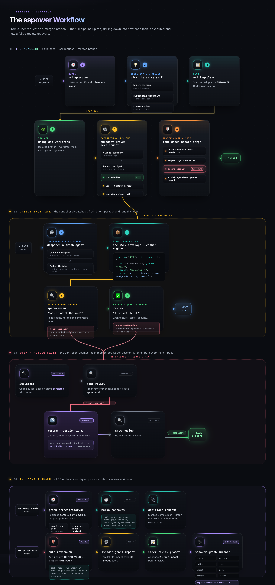

<div align="center">

# ⚡ sspower

**A complete software development workflow for Claude Code** — native Codex integration, macOS-first design.

[](LICENSE)
[](.claude-plugin/plugin.json)
[](#)
[](https://claude.com/claude-code)
[](#-all-19-skills)
[](https://sskys18.github.io/sspower/)

*19 composable skills that automatically trigger during your workflow — mandatory workflows, not suggestions. The agent checks for relevant skills before every task.*



<sub>The full sspower workflow, end to end — 6-phase pipeline · SDD per-task loop · Codex fix loop &nbsp;·&nbsp; <a href="docs/assets/flow.pdf">PDF</a></sub>

</div>

> A standalone project, inspired by [Superpowers](https://github.com/obra/superpowers) v5.0.5 and several other open-source tools — see [Inspired by](#-inspired-by).

---

## 📑 Contents

- [What's new in 1.1](#-whats-new-in-11)
- [Installation](#-installation)
- [How SDD Works with Codex](#-how-sdd-works-with-codex)
- [5 Review Gates Before Merge](#-5-review-gates-before-merge)
- [All 19 Skills](#-all-19-skills)
- [Codex Observability](#-codex-observability)
- [Architecture](#-architecture)
- [Inspired by](#-inspired-by)
- [License](#-license)

---

## ✨ What's new in 1.1

| Feature | In one line |
|---------|-------------|
| 🥗 **Diet mode** | Terse-output mode for token efficiency — `/diet lite\|full\|ultra\|off`, on by default. |
| 🧠 **Project memory** | Every session is archived into `sspower-mem` as searchable memory. |
| 🔗 **Wired skills** | `brainstorming` / `writing-plans` / `systematic-debugging` recall prior decisions + gotchas before proposing work. |
| ⚙️ **Codex profiles** | Model / effort / tier come from `~/.codex/config.toml` profiles — per-call `--profile` / `--model` / `--effort` overrides. |
| ✂️ **Command rewrite** | Three chained `PreToolUse:Bash` hooks rewrite shell commands for token savings. |
| 🛡️ **Auto-review gate** | Codex reviews the branch diff at `git push` / PR and blocks on a non-`approve` verdict. |
| 🚧 **Skill HARD-GATEs** | `writing-plans`, SDD, and branch-finish run Codex review at earlier checkpoints. |
| 🕸️ **sspower-graph (P3 shipped at 1.4.0)** | Per-project symbol graph via MCP: 7 query tools (`graph_status/callers/callees/trace/impact/node/context`) + adoption metric harness + reviewer-agent guidance. Spec: `docs/specs/2026-05-27-codegraph-graph-P3-design.md`. |

<details>
<summary><b>Full detail</b></summary>

- **Diet mode** — terse-output mode for token efficiency. SessionStart hook activates `full` by default; `/diet lite|full|ultra|off` toggles intensity. Per-turn reinforcement keeps it from drifting. The diet ruleset also governs commit-message and code-review formatting (terse Conventional Commits, one-line review comments) — no separate skill needed. Companion skill: `/compress-memory`.
- **Project memory (sspower-mem)** — PreCompact + SessionEnd hooks archive each session: a structured JSON sidecar into `<cwd>/.claude/wiki/sessions/` (legacy belt) and an `episodic` block ingested into the `sspower-mem` backend. The per-session markdown file and `index.md` are no longer written (Phase E). The JSON sidecar is symlinked into `~/.claude/sessions/` for cross-project tooling.
- **Wired skills** — `brainstorming`, `writing-plans`, and `systematic-debugging` read/write decisions + gotchas via the `sspower-mem` CLI before proposing work, so prior context informs every new design and bug investigation.
- **Codex defaults** — tier/model/effort are governed by `~/.codex/config.toml` profiles (`quick`/`normal`/`deep`, single source of truth). `codex-bridge.mjs` selects a per-command profile (`COMMAND_PROFILE`) and passes `-p`; override per-call with `--profile` / `--model` / `--effort` (explicit flags patch individual profile fields).
- **Command rewrite hooks** — three `PreToolUse:Bash` hooks chain in order: (1) `hooks/semble-rewrite.sh` opportunistically rewrites `ls -R [path]` and `grep -R <BARE_IDENT> [path]` to `semble_rs tree` / `semble_rs search --compact` (gitignore-aware; explicit `ask` permission; fail-open noop on unquoted globs/vars or missing binary). (2) `hooks/cmd-rewrite.sh` routes remaining shell commands through an external rewriter for token-saving substitutions — default [`rtk`](https://github.com/rtk-ai/rtk) Rust binary; override with `CMD_REWRITER=<bin>`; needs binary (>= 0.23.0) + `jq` on PATH or no-ops. (3) `hooks/auto-review.sh` (see next bullet). Bypass semble layer with `SSPOWER_SEMBLE_REWRITE=0`.
- **Auto-review at merge surface** — `PreToolUse:Bash` hook (`hooks/auto-review.sh`) intercepts `git push`, `gh pr create`, and `gh pr ready`, runs Codex review on the branch diff vs upstream, and blocks the action when the verdict is not `approve` (issues surfaced to Claude). Iteration cost is zero (local commits aren't reviewed); review fires once per chokepoint. Bypass with `SSPOWER_AUTO_REVIEW=off` for emergencies.
- **Codex HARD-GATEs in skills** — `writing-plans` runs `bridge spec-review` before handing off to execution; `subagent-driven-development` runs `bridge spec-review` + `bridge review` per task; `finishing-a-development-branch` runs `bridge review` on the full branch diff before merge/PR. Skill-level gate complements the hook-level gate above.
- **sspower-graph (P3 shipped at 1.4.0)** — per-project symbol graph subsystem inspired by [codegraph (MIT)](https://github.com/colbymchenry/codegraph). P3 ships 7 MCP query tools (`graph_status/callers/callees/trace/impact/node/context`) over a shared pure-data query layer (`scripts/graph/queries.mjs`), per-project session-state lookup at `~/.claude/state/sspower/sessions/<sha8(realpath(cwd))>.json` with cwd-equality validation, adoption-metric harness (per-process JSONL spool → SessionEnd reconciler → `sspower-graph metric` aggregator with strict gate over 50 most-recent eligible sessions), bootstrap server-key collision preflight (exit 78 on foreign owner), and `## Graph tool guidance` sections appended to `code-reviewer.md` / `sanity-reviewer.md` / `security-reviewer.md` with the hard rule "call graph tools BEFORE delegating to Explore, never inside Explore." Earlier phases: P0 foundation (intent class + lock helpers + MCP stub), P1 TS/JS extractor, P2 multi-language + refresh + trace/impact/context CLI. Hard deps: ast-grep ≥0.43, Node ≥22.5 (node:sqlite stable), bun (lockfile committed). P4 next: hooks orchestration + auto-review enrichment. P5+ framework routes. Full spec at `docs/specs/2026-05-27-codegraph-graph-P3-design.md` (5 codex review passes to approve).

</details>

## sspower-graph

### CLI (P1 + P2)

```
sspower-graph build [--cwd <dir>]
sspower-graph refresh [--cwd <dir>]                       # P2
sspower-graph session-refresh [--max-time <sec>]          # P2
sspower-graph callers <name> [--limit N] [--disambiguate] [--json]
sspower-graph callees <name> [--limit N] [--json]
sspower-graph trace <from> <to> [--max-hops N] [--json]   # P2
sspower-graph impact <file> [--json]                       # P2
sspower-graph context <task> [--json]                      # P2
sspower-graph node <name> [--json]
sspower-graph status [--json]
sspower-graph serve --mcp                # P3 MCP server (7 graph tools)
```

`build` indexes the current working directory (or `--cwd`) into
`<cwd>/.claude/graph/index.sqlite`. `refresh` (P2) does an incremental
update driven by the JSONL `dirty` queue: a two-phase reverse-import
closure transaction processes only files touched since the last build,
with automatic fall-through to a full rebuild when >500 files are
dirty. `session-refresh` plans the right action at SessionStart via
git filesethash + rowid-stride sampling. Languages supported:
TypeScript, JavaScript, Python, Go, Rust (all fixture-gated at
P≥0.85, R≥0.70).

The P2 query verbs round out the surface: `trace` runs a bidirectional
BFS between two symbols, `impact` reports transitive callers of any
node defined in a target file, and `context` composes an FTS5-driven
top-N lookup with caller/callee neighborhoods (capped at 4KB for the
P4 graph-orchestrator budget).

If you already have an MCP server registered under the key
`sspower-graph` from another plugin or your own config, the sspower
bootstrap detects the collision at startup and exits 78 with a clear
stderr message. To coexist:

1. Edit `<plugin-root>/.mcp.json` and rename `mcpServers.sspower-graph`
   to a unique key (e.g. `sspower-graph-v2`). This is the canonical
   way to disambiguate.
2. Export `SSPOWER_GRAPH_MCP_KEY=<your-new-key>` so the bootstrap
   preflight looks for collisions against the renamed key instead of
   the default `sspower-graph`.

Setting `SSPOWER_GRAPH_MCP_KEY` alone does NOT rename the registered
server — both steps are required for full coexistence. The env var
only changes which key the preflight scans for.

`callers <name>` returns the call-sites that target `<name>`. If
multiple symbols match by name, pass `--disambiguate` (or query with
a `Class.method` form). Output line shape:

```
<file>:<line>\t<caller_qname>\t-> <target_qname>\t(conf=<0|1|2>)
```

Confidence: `1` = intra-file qname match, `2` = cross-file via
resolved import, `0` = ambiguous same-name fallback.

### Known P1 limits (P2 followups)

- **Default-import aliases not resolved.** `import run from './mod'`
  where `mod.ts` has `export default function actualName` produces no
  edge — the resolver doesn't know which node in `mod.ts` is the default
  export. Workaround: re-export by name (`export { actualName }` +
  `import { actualName } from './mod'`) or call the actual function
  name. P2 will tag default-exported nodes during extraction.
- **JS files round-trip through a temp `.ts`/`.tsx`** because the
  ast-grep rules pin `language: typescript`. Adds I/O per JS file.
  P2 cleanup: parallel `js-*.yml` rules.
- **`.jsx`/`.tsx` JSX parsing is best-effort.** Component declarations
  and JSX handler call-sites are extracted, but exotic JSX-ts edge
  cases may miss. P5+ adds React-specific framework patterns.

### Performance budgets (P2 acceptance gates, spec §4)

- 10k-file repo, cold `build`: < 60s (M-series Mac)
- warm `callers` p95: < 1s

Reproduce: `SSPOWER_GRAPH_PERF=1 bash tests/graph/test-perf-10k.sh`. The
bench is opt-in; CI does not run it. P2 baseline on M-series:
build ≈ 19s, callers p95 ≈ 0.07ms. Achieved via two optimizations:
(1) Phase 1 extract runs through a bounded worker pool
(`SSPOWER_GRAPH_BUILD_CONCURRENCY`, defaults to `os.cpus().length`);
(2) each per-file extractor batches its rule set into one ast-grep
`--inline-rules` invocation (cuts subprocess spawns 6× for TS).

> 📐 **[Architecture site →](https://sskys18.github.io/sspower/)** — interactive page covering hooks, bridge, sandbox, and memory. Markdown source: [docs/ARCHITECTURE.md](docs/ARCHITECTURE.md).

---

## 🚀 Installation

### Prerequisites

- **Node.js ≥ 22** (required by MCP SDK; check with `node --version`).
- **ast-grep ≥ 0.43** (`brew install ast-grep` on macOS; `cargo install ast-grep`
  elsewhere). Required for the symbol graph extractor (P1+); P0 install
  works without it but the graph subsystem won't index code until ast-grep
  is on `PATH`.

```bash
# Add the marketplace
/plugin marketplace add sskys18/sspower

# Install the plugin
/plugin install sspower@sspower
```

### Codex Integration (Optional)

sspower calls the Codex CLI directly for independent review and implementation — no external Claude Code plugin needed.

```bash
npm install -g @openai/codex
codex login
```

> Without Codex, all skills work except `second-opinion` and the Codex engine in SDD.

---

## 🤖 How SDD Works with Codex

Subagent-Driven Development dispatches a fresh agent per task. Two engines share the same structured JSON contracts — see the **Inside Each Task** and **When a Review Fails** panels in the diagram above.

### Engine Selection

| Task | Engine | Why |
|------|--------|-----|
| Simple, 1-2 files | Claude subagent | Fast, can ask questions mid-task |
| Complex, unfamiliar code | Codex | Different model, full repo scan |
| Needs mid-task Q&A | Claude subagent | Interactive dialogue |
| User requests Codex | Codex | Respect preference |

### Fix Loops

When a review fails, the controller resumes the implementer's Codex session — Codex remembers everything it built. The implementer runs in a **persisted** session; each reviewer is **ephemeral**. On a non-compliant verdict, the controller resumes the persisted session so the fix carries full build context. (See the **When a Review Fails** panel in the diagram above.)

---

## 🛡️ 5 Review Gates Before Merge

| # | Gate | Who | When |
|---|------|-----|------|
| 1 | Self-review | Implementer | Per task |
| 2 | Spec compliance | Claude or Codex | Per task |
| 3 | Code quality | Claude or Codex | Per task |
| 4 | Final review | Claude code-reviewer | All tasks |
| 5 | Second opinion | Codex (independent) | Before merge |

---

## 🧩 All 19 Skills

| Skill | Category | What it does |
|-------|----------|-------------|
| `using-sspower` | Meta | Skill reference/catalog (the `prompt-submit` hook routes; this is the lookup) |
| `brainstorming` | Design | Ideas through collaborative design |
| `writing-plans` | Planning | Specs into implementation plans |
| `subagent-driven-development` | Execution | Per-task subagents with dual-engine (Claude + Codex) |
| `executing-plans` | Execution | Simpler inline/subagent/Codex execution |
| `test-driven-development` | Testing | RED-GREEN-REFACTOR cycle |
| `systematic-debugging` | Debugging | 4-phase root cause investigation |
| `dispatching-parallel-agents` | Collaboration | Concurrent independent work |
| `requesting-code-review` | Review | Dispatch reviewer subagent |
| `receiving-code-review` | Review | Handle feedback with technical rigor |
| `second-opinion` | Review | Routes to `sanity-reviewer`/`security-reviewer` subagents or Codex `review`/`implement --write` depending on scope (hard gate) |
| `verification-before-completion` | QA | Evidence before claims |
| `using-git-worktrees` | Workflow | Isolated workspace setup |
| `finishing-a-development-branch` | Workflow | Merge/PR/keep/discard + cleanup |
| `codex-tracking` | Codex | Inspect / steer / kill running Codex bridge sessions |
| `codex-diagnostics` | Codex | Examine bridge log, propose patches for recurring errors |
| `writing-skills` | Meta | TDD for skill development |
| `diet` | Output | Terse-mode toggle (`/diet lite\|full\|ultra\|off`); also governs commit-message + code-review formatting |
| `compress-memory` | Output | Compress CLAUDE.md / preferences into terse format |

---

## 📊 Codex Observability

The bridge + hook write errors and warnings to a single log file:

```
~/.claude/sspower/codex.log
```

One line per event, append-only, rotated at 1000 lines (keeps last 500).

<details>
<summary><b>Log format, sources & event stream</b></summary>

**Format**:
```
2026-05-22T07:08:14Z [error] bridge.review kind="schema_parse_fail" session="..." raw_preview="..."
2026-05-22T07:09:33Z [warn]  hook.prompt-submit kind=autostart_failed
2026-05-22T07:10:50Z [warn]  hook.auto-review kind=deny_verdict verdict=needs-attention
```

**Sources**:
- `bridge.die` — fatal bridge errors (missing flag, codex CLI not found, trust issues)
- `bridge.<subcommand>` — runtime errors from implement/review/plan-review/rescue/resume
- `bridge.auto_commit` — worktree commit failures
- `hook.prompt-submit` — workflow-engine routing outcomes (e.g. `autostart_failed`)
- `hook.auto-review` — push/PR/merge gate denials (`deny_predecessor` / `deny_successor` / `deny_rounds_cap` / `deny_verdict` / `codex_timeout_allow`)
- `hook.auto-spec-gate` — plan-commit gate denials (`deny_predecessor` / `deny_successor` / `deny_plan_review` / `codex_failed_allow`)

**Live event stream** (during runs, stderr):
- `[codex:session]` / `[codex:agent]` / `[codex:think]` / `[codex:tool]` / `[codex:result]` / `[codex:exec]` / `[codex:edit]` / `[codex:token]` / `[codex:error]` / `[codex:alive]` (30s heartbeat) / `[codex:done]` / `[codex:event]` (unknown/schema-drift)
- Requires `codex exec --json`; bridge passes this automatically on CLI v0.124+. Output-delta streams render but don't inflate counters; `patch_apply_end (failed)` renders for visibility but doesn't count as an applied edit.

**Final envelope** (structured JSON, `_meta`):
```json
{
  "status": "DONE",
  "files_changed": [...],
  "tests": {...},
  "_commit": "abc123",
  "_branch": "codex/task-1",
  "_meta": {
    "session_id": "...",
    "duration_ms": 47823,
    "tool_calls": 12,
    "edits": 3,
    "errors": 0,
    "tokens": { "input": 45230, "output": 8910, "total": 54140 }
  }
}
```

</details>

**Diagnose**: say "examine codex log" or invoke the `codex-diagnostics` skill — it groups errors, matches known patterns, and proposes patches.

**Workflow-engine routing** (`hooks/prompt-submit` + `hooks/_intent.sh`):
- One shared intent classifier (`_intent.sh`) labels each prompt
  `qa` / `explicit-skill` / `simple-coding` / `multi-step`.
- An active flow → the hook injects the current stage's marching orders.
- Idle + `multi-step` → a flow is **auto-started** (`scripts/flow.sh`); the
  injection carries an "abort if trivial" bail-out.
- Idle + `simple-coding` → one targeted skill trigger; `qa` → nothing.
- Opt out of auto-start for one prompt: prefix it with `quick:`.
- Inspect/clear a flow: `/flow status`, `/flow abort`.

---

## 🏗️ Architecture

```
sspower/
  scripts/codex-bridge.mjs    -- Direct Codex CLI bridge
  schemas/                     -- Structured output contracts
    implementation-output.json
    spec-review-output.json
    quality-review-output.json
  agents/
    code-reviewer.md           -- Claude review subagent
    codex-rescue.md            -- Codex delegation subagent
    security-reviewer.md       -- Manual security pass (vuln/auth/crypto)
    sanity-reviewer.md         -- Independent second opinion (real-blocker-only)
  hooks/
    _intent.sh                 -- Shared intent classifier (sourced)
    session-start              -- Injects a short workflow-engine notice
    prompt-submit              -- Workflow-engine router: auto-start flow / targeted trigger
  scripts/
    flow.sh                    -- plan->review->exec->test->review state machine
  skills/                      -- 19 skill directories
    */SKILL.md                 -- Lean entry point (<100 lines)
    */references/              -- Detailed docs (loaded on demand)
```

### Token-Efficient Progressive Disclosure

| Skill | Original | sspower SKILL.md | sspower references/ |
|-------|----------|------------------|---------------------|
| writing-skills | 647 lines | ~50 lines | 3 files (344 lines) |
| test-driven-development | 313 lines | ~50 lines | 1 file (74 lines) |
| systematic-debugging | 263 lines | ~50 lines | 2 files (227 lines) |
| subagent-driven-development | 279 lines | ~160 lines | 3 files (250 lines) |

---

## 🙏 Inspired by

sspower is a standalone project, but it stands on ideas and tools from the
open-source community. Thanks to:

| Project | What sspower drew from it |
|---------|---------------------------|
| [Superpowers](https://github.com/obra/superpowers) — [Jesse Vincent](https://blog.fsck.com) & [Prime Radiant](https://primeradiant.com) | The skill-routing architecture and the core development-workflow skills. sspower began as a fork of v5.0.5 and has since diverged. Licensed MIT (see LICENSE). |
| [OpenAI Codex CLI](https://github.com/openai/codex) | The independent review / implementation engine behind `second-opinion`, auto-review, and the SDD Codex path. |
| [rtk](https://github.com/rtk-ai/rtk) | The default command-rewriter for token-saving shell substitutions (`hooks/cmd-rewrite.sh`). |
| [mem0](https://github.com/mem0ai/mem0) | The memory store powering `sspower-mem` — raw + extracted records, embeddings, vector search. |
| `semble_rs` | gitignore-aware `tree` / `search` rewriting used by `hooks/semble-rewrite.sh`. |
| `caveman` | The token-diet output mode (`/diet`, SessionStart diet-activate hook). |

---

## 📄 License

MIT — see [LICENSE](LICENSE) file. Copyright is shared: original Superpowers code
© Jesse Vincent; sspower modifications © sskys18.

<div align="center">
<sub>Built for <a href="https://claude.com/claude-code">Claude Code</a> · macOS-first · MIT licensed</sub>
</div>
