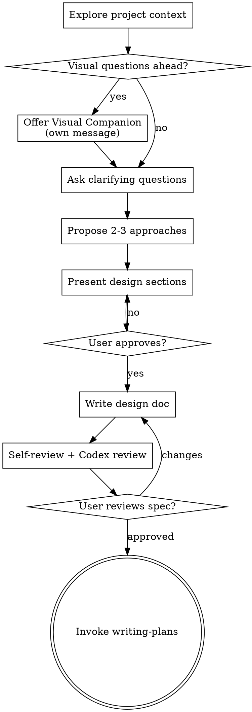

# Brainstorming Ideas Into Designs

Help turn ideas into fully formed designs through collaborative dialogue.

## Pre-flight: read project wiki

Before proposing any approach, read these if they exist:

- `<cwd>/.claude/wiki/decisions.md` — prior architectural calls, ground new design in them
- `<cwd>/.claude/wiki/sessions/` — last 3 session `.md` files (sort by name, newest = highest YYMMDD prefix) for recent context

Skip silently if the directory doesn't exist (project hasn't archived yet). Surface any contradiction between the user's request and prior decisions before proposing.

<HARD-GATE>
Do NOT invoke any implementation skill, write any code, scaffold any project, or take any implementation action until you have presented a design and the user has approved it. This applies to EVERY project regardless of perceived simplicity.
</HARD-GATE>

## Anti-Pattern: "This Is Too Simple To Need A Design"

Every project goes through this process. A todo list, a single-function utility, a config change — all of them. The design can be short, but you MUST present it and get approval.

## Checklist

You MUST create a task for each item and complete them in order:

1. **Explore project context** — check files, docs, recent commits
2. **Offer visual companion** (if visual questions ahead) — own message, not combined with other content
3. **Ask clarifying questions** — one at a time, understand purpose/constraints/success criteria
4. **Propose 2-3 approaches** — with trade-offs and your recommendation
5. **Present design** — sections scaled to complexity, get user approval after each
6. **Write design doc** — save to `docs/specs/YYYY-MM-DD-<topic>-design.md` and commit
7. **Spec self-review** — placeholder scan, consistency, scope, ambiguity (see `references/after-design.md`)
8. **Codex spec review** — independent review via `codex-bridge.mjs rescue`
9. **User reviews written spec** — ask user before proceeding
10. **Transition to implementation** — invoke writing-plans skill (the ONLY next skill)

For detailed process guidance: `references/design-process.md`
For post-design steps (reviews, docs, handoff): `references/after-design.md`
For visual companion setup: `visual-companion.md`

## Key Principles

- **One question at a time** — don't overwhelm
- **Multiple choice preferred** — easier than open-ended
- **YAGNI ruthlessly** — remove unnecessary features
- **Explore alternatives** — always 2-3 approaches before settling
- **Incremental validation** — present, approve, move on
