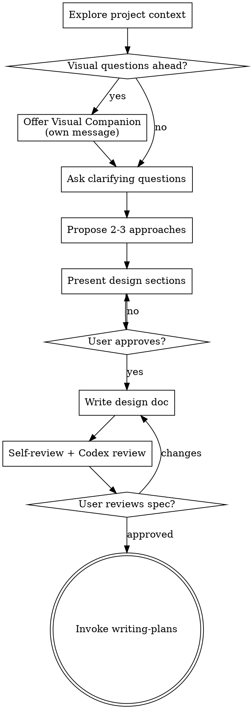

# Brainstorming Ideas Into Designs

Help turn ideas into fully formed designs through collaborative dialogue.

## Pre-flight: read prior decisions

Before proposing any approach, query the project's memory backend for prior
architectural decisions and recent session context:

```bash
sspower-mem search --scope project --layer decision --mode recent --top-k 5 --json
sspower-mem search --scope project --layer episodic --mode recent --top-k 3 --json
```

When you have a concrete task description, swap `--mode recent` for
`--query "<task description>"` on the `decision` search to align by relevance.

If the command is unavailable or returns no results, skip silently (the
project may not have a memory backend yet). Surface any contradiction between
the user's request and a prior decision before proposing.

## Interview benchmark (score-then-ask)

Before EVERY question round, self-score the brief — one line of
justification per dimension:

| Dimension | Greenfield weight | Brownfield weight | Floor |
|---|---|---|---|
| Goal clarity | .40 | .35 | .75 |
| Constraint clarity | .30 | .25 | .65 |
| Success-criteria clarity | .30 | .25 | .70 |
| Context clarity | — | .15 | .60 |

Use ONE column of weights (they each sum to 1.0): greenfield = no
existing codebase; brownfield = working in an existing repo.
`ambiguity = 1 − weighted sum`. **Seed-ready: ambiguity ≤ 0.2 AND all
floors met.** Questions target the weakest failing dimension only — no
generic "anything else?" rounds.

**4-class gap resolution.** Classify every open gap before asking:
1. **user-fact** — already answered in the brief; extract it
2. **repo-fact** — answerable by reading the repo; read it, don't ask
3. **safe-default** — conservative + reversible; take it and record it
4. **blocker** — credentials, prod decisions, destructive scope; the
   ONLY class that earns a user question

**Round cap: 5.** At cap, close remaining gaps with auditable safe
defaults; hard-block only when defaulting is genuinely unsafe.

**Audit trail (mandatory in the design doc):** `## Clarity scorecard`
(final per-dimension scores + justifications) and `## Defaults taken`
(each default + reversal path).

**Optional fresh-context re-score** for large specs: spawn one verifier
subagent to re-score the scorecard blind before presenting the design.

## Recording decisions

When the design is approved, record each load-bearing architectural call:

```bash
sspower-mem add --scope project --layer decision --content "<one-line call + reasoning>"
```

<HARD-GATE>
Do NOT invoke any implementation skill, write any code, scaffold any project, or take any implementation action until you have presented a design and the user has approved it. This applies to EVERY project regardless of perceived simplicity.
</HARD-GATE>

## Anti-Pattern: "This Is Too Simple To Need A Design"

Every project goes through this process. A todo list, a single-function utility, a config change — all of them. The design can be short, but you MUST present it and get approval.

## Checklist

You MUST create a task for each item and complete them in order:

1. **Explore project context** — check files, docs, recent commits
2. **Offer visual companion** (if visual questions ahead) — own message, not combined with other content
3. **Ask clarifying questions** — score-then-ask (see Interview benchmark); one at a time; blockers only
4. **Propose 2-3 approaches** — with trade-offs and your recommendation
5. **Present design** — sections scaled to complexity, get user approval after each
6. **Write design doc** — save to `docs/specs/YYYY-MM-DD-<topic>-design.md` and commit
7. **Spec self-review** — placeholder scan, consistency, scope, ambiguity (see `references/after-design.md`)
8. **Codex spec review** — independent review via `codex-bridge.mjs plan-review`
9. **User reviews written spec** — ask user before proceeding
10. **Transition to implementation** — invoke writing-plans skill (the ONLY next skill)


```dot
digraph brainstorming {
    "Explore project context" [shape=box];
    "Visual questions ahead?" [shape=diamond];
    "Offer Visual Companion\n(own message)" [shape=box];
    "Ask clarifying questions" [shape=box];
    "Propose 2-3 approaches" [shape=box];
    "Present design sections" [shape=box];
    "User approves?" [shape=diamond];
    "Write design doc" [shape=box];
    "Self-review + Codex review" [shape=box];
    "User reviews spec?" [shape=diamond];
    "Invoke writing-plans" [shape=doublecircle];

    "Explore project context" -> "Visual questions ahead?";
    "Visual questions ahead?" -> "Offer Visual Companion\n(own message)" [label="yes"];
    "Visual questions ahead?" -> "Ask clarifying questions" [label="no"];
    "Offer Visual Companion\n(own message)" -> "Ask clarifying questions";
    "Ask clarifying questions" -> "Propose 2-3 approaches";
    "Propose 2-3 approaches" -> "Present design sections";
    "Present design sections" -> "User approves?";
    "User approves?" -> "Present design sections" [label="no"];
    "User approves?" -> "Write design doc" [label="yes"];
    "Write design doc" -> "Self-review + Codex review";
    "Self-review + Codex review" -> "User reviews spec?";
    "User reviews spec?" -> "Write design doc" [label="changes"];
    "User reviews spec?" -> "Invoke writing-plans" [label="approved"];
}
```

For detailed process guidance: `references/design-process.md`
For post-design steps (reviews, docs, handoff): `references/after-design.md`
For visual companion setup: `visual-companion.md`

## Key Principles

- **One question at a time** — don't overwhelm
- **Multiple choice preferred** — easier than open-ended
- **YAGNI ruthlessly** — remove unnecessary features
- **Explore alternatives** — always 2-3 approaches before settling
- **Incremental validation** — present, approve, move on
