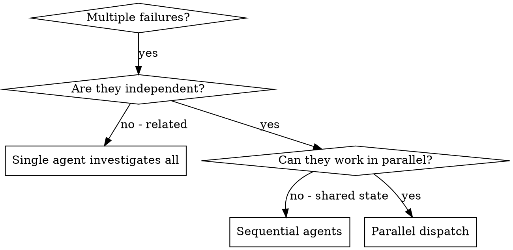

# Dispatching Parallel Agents

Delegate tasks to specialized agents with isolated context. They never inherit your session — you construct exactly what they need.

**Core principle:** One agent per independent problem domain. Let them work concurrently.

## When to Use

**Use when:** 3+ failures with different root causes, multiple independent subsystems broken, no shared state between investigations.

**Don't use when:** Failures are related, need full system context, agents would interfere (editing same files).

## Task tool vs native Workflow — route first

This skill = the **Task tool**: a small fan-out (≤~8 agents) you dispatch in one
turn and integrate by hand into *your* context. That is the right tool for a
few independent problems.

Switch to the native **Workflow** tool when the job crosses the
**scale-or-verification** gate:

- ≳8 independent units, **OR**
- each result needs independent adversarial verification before you trust it.

Below the line, stay on the Task tool — add an explicit output format if you
need structure. Structured output and background/resume *follow from* scale;
they are not separate triggers. (Same gate `orchestrating-workflows` uses — the
two skills route on one rule, never contend.)

Then invoke `sspower:orchestrating-workflows`. Routing here is a
*recommendation*, **not** opt-in: if the user explicitly asked for a
workflow/background run, author it; if you only inferred it from scale, confirm
before spinning up the background agents (see that skill's § Opt-in). Workflow
nests *inside* a flow stage when fan-out-shaped — it does not replace flow.

**Either way, git chokepoints stay in the main thread / flow MERGE** — never
inside a fan-out agent (parallel git races the index; see
`orchestrating-workflows` for the full constraint).

## Batch Sizing

For **bulk file changes** (same edit across many files), batch 5-8 files per agent. Too few agents = slow. Too many files per agent = context overload.

| Files | Agents | Files/Agent |
|-------|--------|-------------|
| 6-8   | 1      | 6-8         |
| 9-16  | 2      | 5-8         |
| 17-24 | 3      | 6-8         |
| 25+   | 4-5    | 5-8         |

For **distinct problem domains** (debugging, different subsystems), use 1 agent per domain regardless of file count.

## The Pattern

1. **Identify independent domains** — group by what's broken or what's changing
2. **Size batches** — bulk changes: 5-8 files/agent. Distinct problems: 1 agent/domain
3. **Create focused agent tasks** — each gets: specific scope, clear goal, constraints, expected output format
4. **Dispatch in parallel** — all agents run concurrently
5. **Review and integrate** — read summaries, verify no conflicts, run full suite

## Verification After Integration

1. Review each agent's summary
2. Check for conflicts (did agents edit same code?)
3. Run full test suite
4. Spot check — agents can make systematic errors

See `references/examples.md` for prompt templates, common mistakes, and a real-world walkthrough.
