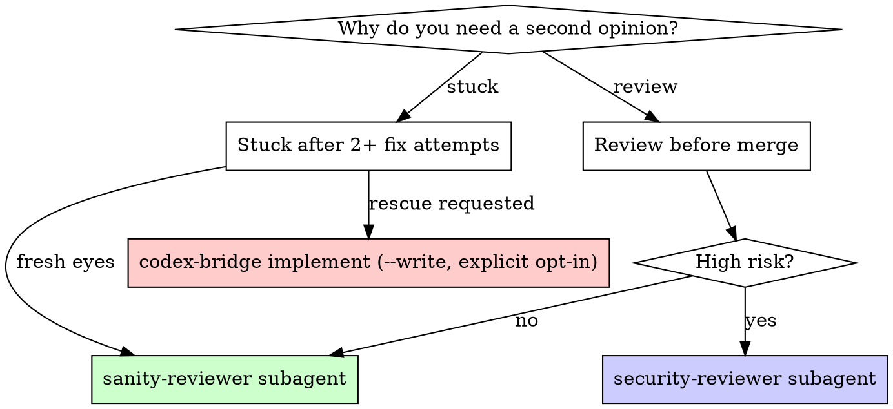

# Second Opinion

Route to the right Codex review based on context. This is a genuinely independent review — different model, no shared context, catches what Claude won't.

## When This Triggers

- Before merge (called by sspower:finishing-a-development-branch)
- After Claude code review passes (called by sspower:requesting-code-review)
- User says "second opinion", "independent review", "check this"
- You've failed to fix something 2+ times

## Decision Flow



## High-Risk Signals

Use adversarial review prompt when changes touch:
- Authentication, authorization, session handling
- Payment, billing, financial data
- Database migrations, schema changes
- Security-sensitive code (crypto, tokens, secrets)
- Core architecture, shared abstractions
- Public API contracts

Otherwise use standard quality review.

## Execution

Resolve the bridge path:
```bash
SSPOWER_PLUGIN_ROOT=$(dirname "$(dirname "$(find ~/.claude/plugins -name codex-bridge.mjs -path "*/sspower/*" | head -1)")")
```

1. **Check diff size:** `git diff --shortstat`
2. **Pick the right path** — read-only opinion vs write-capable rescue
   are deliberately separate; the user can request either explicitly:
   - **Want fresh eyes (read-only second opinion):** route to the
     `sanity-reviewer` subagent — independent correctness pass,
     real-blocker-only, no writes. Use for *before-merge* and the
     "I'm stuck after 2+ attempts, am I missing something obvious?"
     case (per CLAUDE.md line 22).
   - **Want unblocked (write-capable rescue):** explicit user opt-in
     only. `node "${SSPOWER_PLUGIN_ROOT}/scripts/codex-bridge.mjs" implement --write --cd . --prompt @/tmp/rescue-prompt.md`
     This MODIFIES files; do not invoke just because the user is
     stuck — ask first.
   - **Standard review:** `node "${SSPOWER_PLUGIN_ROOT}/scripts/codex-bridge.mjs" review --cd . --prompt @/tmp/review-prompt.md`
   - **Security in scope:** route to the `security-reviewer` subagent
     (vuln / auth / crypto pass).
3. **Present Codex / subagent output verbatim** — do NOT paraphrase or filter
4. **If issues found:** ask user which to address, fix, re-run (max 2 iterations)
5. **If approved:** proceed

## Rules

- Never filter or summarize Codex output — it's the user's second opinion
- Never tell Codex what Claude's review found — reviewer independence
- If Codex and Claude disagree, present both and let user decide
