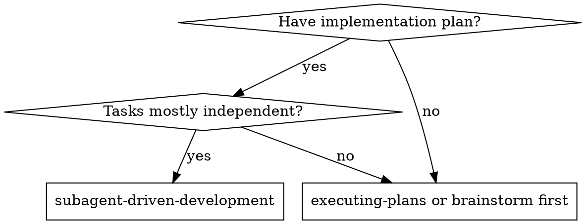
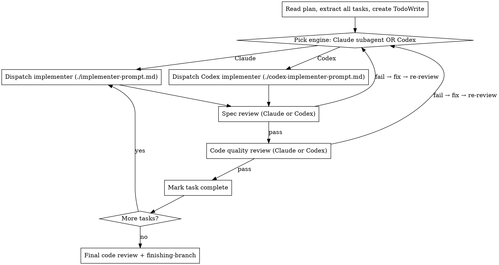

# Subagent-Driven Development

Execute plan by dispatching fresh subagent per task, with two-stage review after each: spec compliance first, then code quality.

<HARD-GATE>
**Codex review is MANDATORY for both review stages, not optional.** After every task implementation, run `codex-bridge.mjs spec-review` then `codex-bridge.mjs review`. Block on each `verdict`:
- `approve` → proceed.
- `needs-attention` → fix every issue, re-run review until `approve`.
- `reject` → return to implementation.

Claude-only reviews are insufficient for the merge gate. The Codex gate is the source of truth.
</HARD-GATE>

**Why subagents:** Isolated context per task. You construct exactly what they need — they never inherit your session history.

**Core principle:** Fresh subagent per task + two-stage review = high quality, fast iteration

## When to Use



## The Process



## Engine & Model Selection

SDD supports two execution engines. Pick per task — they share the same structured contracts.

| Task characteristic | Engine | Model |
|---|---|---|
| 1-2 files, complete spec | Claude subagent | Fast/cheap model |
| Multi-file, well-specified | Claude subagent | Standard model |
| Complex / unfamiliar codebase | **Codex** | Codex CLI default (per `~/.codex/config.toml`) |
| Needs mid-task Q&A | Claude subagent | Standard model |
| Architecture/design/review | Claude subagent | Most capable model |
| User explicitly requests Codex | **Codex** | Default or specified |

### Dispatching with Codex

Instead of the Claude `Task` tool, use `Bash` to call the bridge:

```bash
node "${SSPOWER_PLUGIN_ROOT}/scripts/codex-bridge.mjs" implement \
  --write --cd {WORKING_DIR} --prompt @/tmp/sdd-task-N.md
```

**Prompt template:** See `codex-implementer-prompt.md` — fill placeholders and write to temp file.

**Response:** Structured JSON with identical status codes (`DONE`, `DONE_WITH_CONCERNS`, `BLOCKED`, `NEEDS_CONTEXT`). Parse and handle exactly like Claude subagent reports.

**Key difference:** Codex cannot ask mid-task questions. Front-load all context in the prompt.

**Session tracking:** The bridge prints `[codex:session] <id>` to stderr during implement runs. Capture this ID — you need it for fix loops.

If Codex returns `NEEDS_CONTEXT`, provide context by resuming the implementer session:

```bash
node "${SSPOWER_PLUGIN_ROOT}/scripts/codex-bridge.mjs" resume \
  --session-id {IMPLEMENT_SESSION_ID} --prompt "Context: {ANSWERS_TO_QUESTIONS}"
```

### Codex for Reviews

Spec review and code quality review can also use Codex:

```bash
# Spec review
node "${SSPOWER_PLUGIN_ROOT}/scripts/codex-bridge.mjs" spec-review \
  --cd {WORKING_DIR} --prompt @/tmp/sdd-spec-review-N.md

# Quality review
node "${SSPOWER_PLUGIN_ROOT}/scripts/codex-bridge.mjs" review \
  --cd {WORKING_DIR} --prompt @/tmp/sdd-quality-review-N.md
```

**Prompt templates:** See `codex-spec-reviewer-prompt.md` and `codex-quality-reviewer-prompt.md`.

### Fix Loops with Codex

When a review fails and the implementer was Codex, resume the **implementer's session** (not the reviewer's):

```bash
node "${SSPOWER_PLUGIN_ROOT}/scripts/codex-bridge.mjs" resume \
  --session-id {IMPLEMENT_SESSION_ID} --prompt "Fix: {REVIEW_FINDINGS_JSON}"
```

**Critical:** Use `--session-id` with the ID captured from the implement run. Do NOT use `--last` — after spec/quality reviews, `--last` would resume the reviewer, not the implementer.

Codex retains full context of what it built. No need to re-provide task text or files.

See `references/codex-integration.md` for full details on engine selection, thread management, and error handling.

## Handling Implementer Status

**DONE:** Proceed to spec review.
**DONE_WITH_CONCERNS:** Read concerns. If correctness/scope → address before review. If observations → note and proceed.
**NEEDS_CONTEXT:** Provide missing context and re-dispatch.
**BLOCKED:** Assess: context problem → provide context; needs more reasoning → more capable model; too large → break it up; plan wrong → escalate to human.

## Red Flags

**Never:**
- Start on main/master without explicit consent
- Skip reviews (spec OR quality)
- Skip the Codex review gate, even if the Claude review approved
- Proceed with unfixed issues
- Dispatch parallel implementation subagents
- Make subagent read plan file (provide full text)
- Skip scene-setting context
- **Start code quality review before spec compliance passes**
- Move to next task with open review issues

**If subagent asks questions:** Answer clearly. Don't rush into implementation.
**If reviewer finds issues:** Implementer fixes → reviewer re-reviews → repeat until approved.

See `references/example-workflow.md` for a full walkthrough.

## Integration

- **sspower:using-git-worktrees** - REQUIRED: isolated workspace
- **sspower:writing-plans** - Creates the plan
- **sspower:requesting-code-review** - Review template
- **sspower:finishing-a-development-branch** - After all tasks complete
- **codex-bridge.mjs** - Direct Codex CLI integration (no external plugin dependency)
- **schemas/** - Structured output contracts shared between Claude and Codex engines
