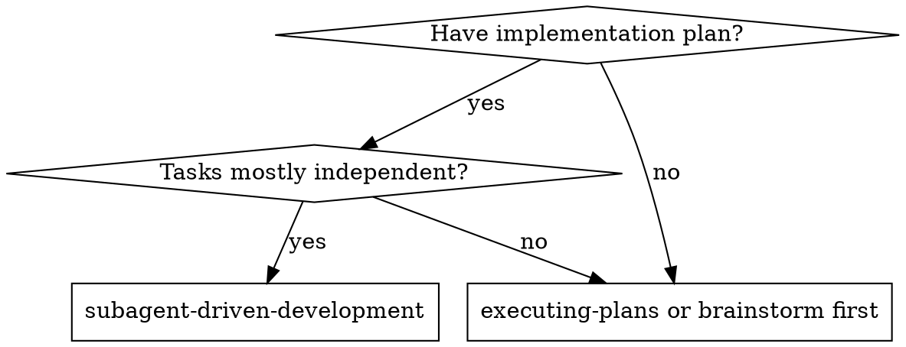
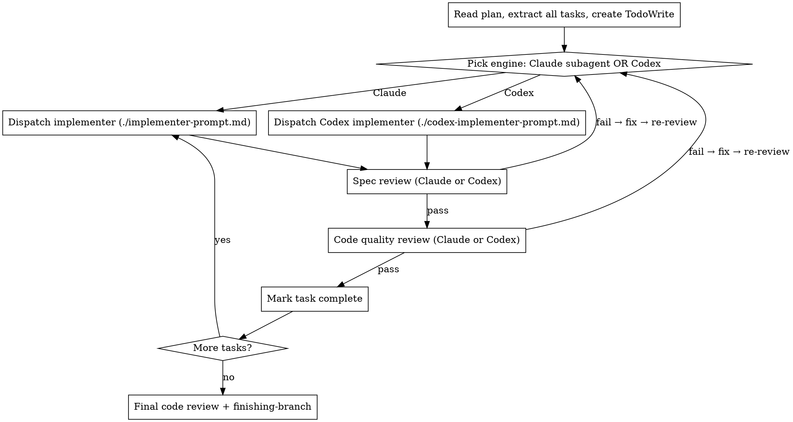

# Subagent-Driven Development

Execute plan by dispatching fresh subagent per task, with two-stage review after each: spec compliance first, then code quality.

**Codex review per task is strongly recommended** for high-quality
iteration. Run `codex-bridge.mjs spec-review` then `codex-bridge.mjs
review` after each task implementation. On each `verdict`:
- `approve` → proceed.
- `needs-attention` → fix every issue, re-run review until `approve`.
- `reject` → return to implementation.

**Final enforcement is automatic:** the `auto-review.sh` PreToolUse hook
runs Codex `review` on the full branch diff before `git push` /
`gh pr create` / `gh pr ready` and **blocks** unless verdict is
`approve`. Claude-only per-task reviews can pass quickly, but the merge
gate is the source of truth — anything that wouldn't survive the branch
review will be caught there. Bypass: `SSPOWER_AUTO_REVIEW=off`
(emergencies only).

**Why subagents:** Isolated context per task. You construct exactly what they need — they never inherit your session history.

**Core principle:** Fresh subagent per task + two-stage review = high quality, fast iteration

## When to Use


```dot
digraph when_to_use {
    "Have implementation plan?" [shape=diamond];
    "Tasks mostly independent?" [shape=diamond];
    "subagent-driven-development" [shape=box];
    "executing-plans or brainstorm first" [shape=box];

    "Have implementation plan?" -> "Tasks mostly independent?" [label="yes"];
    "Have implementation plan?" -> "executing-plans or brainstorm first" [label="no"];
    "Tasks mostly independent?" -> "subagent-driven-development" [label="yes"];
    "Tasks mostly independent?" -> "executing-plans or brainstorm first" [label="no"];
}
```

## The Process


```dot
digraph process {
    rankdir=TB;
    "Read plan, extract all tasks, create TodoWrite" [shape=box];
    "Pick engine: Claude subagent OR Codex" [shape=diamond];
    "Dispatch implementer (./implementer-prompt.md)" [shape=box];
    "Dispatch Codex implementer (./codex-implementer-prompt.md)" [shape=box];
    "Spec review (Claude or Codex)" [shape=box];
    "Code quality review (Claude or Codex)" [shape=box];
    "Mark task complete" [shape=box];
    "More tasks?" [shape=diamond];
    "Final code review + finishing-branch" [shape=box];

    "Read plan, extract all tasks, create TodoWrite" -> "Pick engine: Claude subagent OR Codex";
    "Pick engine: Claude subagent OR Codex" -> "Dispatch implementer (./implementer-prompt.md)" [label="Claude"];
    "Pick engine: Claude subagent OR Codex" -> "Dispatch Codex implementer (./codex-implementer-prompt.md)" [label="Codex"];
    "Dispatch implementer (./implementer-prompt.md)" -> "Spec review (Claude or Codex)";
    "Dispatch Codex implementer (./codex-implementer-prompt.md)" -> "Spec review (Claude or Codex)";
    "Spec review (Claude or Codex)" -> "Code quality review (Claude or Codex)" [label="pass"];
    "Spec review (Claude or Codex)" -> "Pick engine: Claude subagent OR Codex" [label="fail → fix → re-review"];
    "Code quality review (Claude or Codex)" -> "Mark task complete" [label="pass"];
    "Code quality review (Claude or Codex)" -> "Pick engine: Claude subagent OR Codex" [label="fail → fix → re-review"];
    "Mark task complete" -> "More tasks?";
    "More tasks?" -> "Dispatch implementer (./implementer-prompt.md)" [label="yes"];
    "More tasks?" -> "Final code review + finishing-branch" [label="no"];
}
```

## Engine & Model Selection

SDD supports two execution engines. Pick per task — they share the same structured contracts.

| Task characteristic | Engine | Model |
|---|---|---|
| 1-2 files, complete spec | Claude subagent | Fast/cheap model |
| Multi-file, well-specified | Claude subagent | Standard model |
| Complex / unfamiliar codebase | **Codex** | Codex CLI default (per `~/.codex/config.toml`) |
| Needs mid-task Q&A | Claude subagent | Standard model |
| Architecture/design/review | Claude subagent | Most capable model |
| User explicitly requests Codex | **Codex** | Default or specified |

### Dispatching with Codex

Instead of the Claude `Task` tool, use `Bash` to call the bridge:

```bash
node "${SSPOWER_PLUGIN_ROOT}/scripts/codex-bridge.mjs" implement \
  --write --cd {WORKING_DIR} --prompt @/tmp/sdd-task-N.md
```

**Prompt template:** See `codex-implementer-prompt.md` — fill placeholders and write to temp file.

**Response:** Structured JSON with binary status (`DONE` or `BLOCKED`). The schema was narrowed: `DONE_WITH_CONCERNS` and `NEEDS_CONTEXT` were removed as soft-fallback patterns. Bridge enforces additional gates — `DONE` with `tests.ran=false` or `tests.failed > 0` is auto-converted to `BLOCKED`.

**Key difference:** Codex cannot ask mid-task questions. Front-load all context in the prompt. If you missed something, the run returns BLOCKED — resume with the missing context.

**Session tracking:** The bridge prints `[codex:session] <id>` to stderr during implement runs. Capture this ID — you need it for fix loops.

If Codex returns `BLOCKED` with a context gap, resume the implementer session:

```bash
node "${SSPOWER_PLUGIN_ROOT}/scripts/codex-bridge.mjs" resume \
  --session-id {IMPLEMENT_SESSION_ID} --prompt "Additional context: {ANSWERS}"
```

### Codex for Reviews

Spec review and code quality review can also use Codex:

```bash
# Spec review
node "${SSPOWER_PLUGIN_ROOT}/scripts/codex-bridge.mjs" spec-review \
  --cd {WORKING_DIR} --prompt @/tmp/sdd-spec-review-N.md

# Quality review
node "${SSPOWER_PLUGIN_ROOT}/scripts/codex-bridge.mjs" review \
  --cd {WORKING_DIR} --prompt @/tmp/sdd-quality-review-N.md
```

**Prompt templates:** See `codex-spec-reviewer-prompt.md` and `codex-quality-reviewer-prompt.md`.

### Fix Loops with Codex

When a review fails and the implementer was Codex, resume the **implementer's session** (not the reviewer's):

```bash
node "${SSPOWER_PLUGIN_ROOT}/scripts/codex-bridge.mjs" resume \
  --session-id {IMPLEMENT_SESSION_ID} --prompt "Fix: {REVIEW_FINDINGS_JSON}"
```

**Critical:** Use `--session-id` with the ID captured from the implement run. Do NOT use `--last` — after spec/quality reviews, `--last` would resume the reviewer, not the implementer.

Codex retains full context of what it built. No need to re-provide task text or files.

See `references/codex-integration.md` for full details on engine selection, thread management, and error handling.

## Handling Implementer Status

Status enum is binary: `DONE | BLOCKED`. No middle ground — `DONE_WITH_CONCERNS` and `NEEDS_CONTEXT` were removed as soft-fallback patterns.

**DONE:** Proceed to spec review. Implementer asserts the spec is fully implemented AND the test runner ran with zero failures. Bridge enforces both for Codex; verify the report for Claude.

**BLOCKED:** Read `blocked_reason`. Choose one resolution:
- Context problem → resume with the missing context
- Needs more reasoning → re-dispatch with a more capable model
- Too large → break the task into smaller pieces and re-plan
- Plan is wrong → escalate to human, fix the plan, re-dispatch

Never coerce BLOCKED into a partial DONE. Never patch around the obstacle without addressing the root cause.

## Red Flags

**Never:**
- Start on main/master without explicit consent
- Skip reviews (spec OR quality)
- Skip the Codex review gate, even if the Claude review approved
- Proceed with unfixed issues
- Dispatch parallel implementation subagents
- Make subagent read plan file (provide full text)
- Skip scene-setting context
- **Start code quality review before spec compliance passes**
- Move to next task with open review issues

**If subagent asks questions:** Answer clearly. Don't rush into implementation.
**If reviewer finds issues:** Implementer fixes → reviewer re-reviews → repeat until approved.

See `references/example-workflow.md` for a full walkthrough.

## Integration

- **sspower:using-git-worktrees** - REQUIRED: isolated workspace
- **sspower:writing-plans** - Creates the plan
- **sspower:requesting-code-review** - Review template
- **sspower:finishing-a-development-branch** - After all tasks complete
- **codex-bridge.mjs** - Direct Codex CLI integration (no external plugin dependency)
- **schemas/** - Structured output contracts shared between Claude and Codex engines
