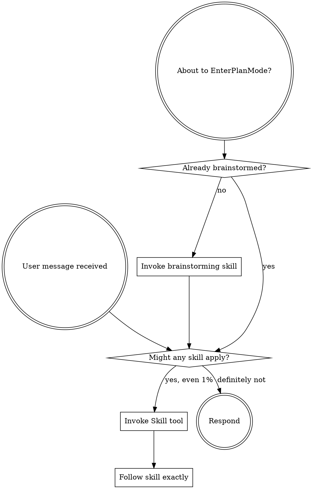

<SUBAGENT-STOP>
If you were dispatched as a subagent to execute a specific task, skip this skill.
</SUBAGENT-STOP>

<EXTREMELY-IMPORTANT>
If there is even a 1% chance a skill might apply, you MUST invoke it. This is not negotiable.
</EXTREMELY-IMPORTANT>

## The Rule

**Invoke relevant skills BEFORE any response or action.** Even 1% chance means invoke the skill. If it turns out wrong, you don't need to use it.

## Skill Priority

1. **Process skills first** (brainstorming, debugging) — determine HOW to approach
2. **Implementation skills second** — guide execution

## Skill Types

**Rigid** (TDD, debugging): Follow exactly. **Flexible** (patterns): Adapt to context.

## Scaling out — dispatch vs Workflow

Three axes for parallel work, do not confuse them:

- **`dispatching-parallel-agents`** — small Task-tool fan-out (≤~8), integrated
  into your context this turn.
- **`orchestrating-workflows`** — the native Workflow tool for large fan-out
  (tens–hundreds of background agents). Structured output, adversarial
  verification, and resume are what it *gives* you.

Single routing gate (identical in both skills): `dispatching-parallel-agents`
hands off to `orchestrating-workflows` when a job is **large (≳8 units)** or
**each result needs independent verification**. Structured output / background
follow from scale — not separate triggers.

## Project memory

`brainstorming`, `writing-plans`, and `systematic-debugging` read and write
project memory (decisions, gotchas, session history) through the `sspower-mem`
CLI rather than `<cwd>/.claude/wiki/*.md` files. When a skill's Pre-flight
calls `sspower-mem search`, that is the project's memory backend — not a stray
shell command. If `sspower-mem` is unavailable the skills degrade silently.

See `references/red-flags-table.md` for the full rationalization table, instruction priority, and platform adaptation details.
